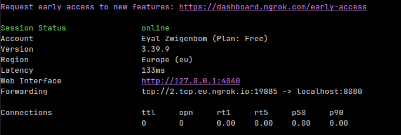

# Run Demo
Because I couldn't find any free TCP hosting services, you will need to host your own server. \
But don't worry, I made it really easy to host your own server and I also wrote a walkthrough on how to do it :)

## Install Client App
First, go to [this link](https://github.com/eyalzwigen/python-cli-chat/releases/tag/client_app) and install the app (according to your OS).\
Enter the server address and port according to the explanations in [here](RUN_DEMO.md#example)

## Host Your Own Server
Install the server program from [this link](https://github.com/eyalzwigen/python-cli-chat/releases/tag/server_program). \
When running the program you need to choose a port on which to bind the server to. you can do this by using the -p flag or the --port argument. Example:
```bash
./server -p 8080
```

if you are not familiar with the terminal you can also double-click the program, and it will automatically set the port to __8080__.

Now, because the server program listens on localhost, you will need to forward the port using some kindd of a service.
This tutorial will use __Ngrok__, but you can choose whatever service you want.

### Setting up ngrok
1. Follow the instructions on https://dashboard.ngrok.com/get-started/ (from step 1 to the authtoken step )
2. run the command:
   ```bash
    ngrok tcp PORT
    ```
   where PORT is the port of choice you put in server.py (remember that if you didn't specify any port when running the server, it will be 8080 by default).

You should see something like this:


copy the link that starts with __tcp://__.

When connecting to the server in client.py, \
the server address should be from the first character after the tcp:// until the ':'.
and the port will be the other part.

#### Example
__link:__ tcp://4.tcp.eu.ngrok.io:1234 \
__server address:__ 4.tcp.eu.ngrok.io \
__server port:__ 1234

This is how it should look like when you run the client app.